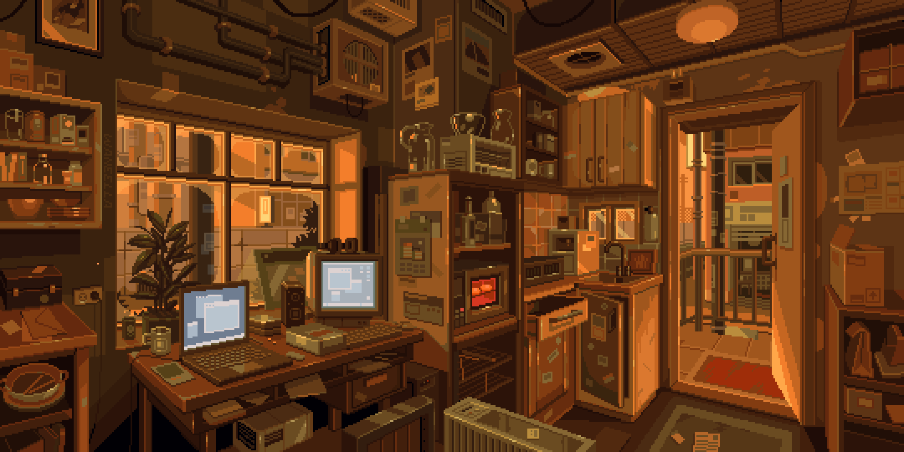

  

#

  👨‍💻 Desenvolvedor com foco em Back-End. 
  🎓 Formado em Desenvolvimento de Sistemas (ETEC) e cursando Informática para Negócios (FATEC). 
  💡 Sempre aprendendo, criando e evoluindo. 
  📍 São José do Rio Preto – SP.

#

<h3 align="left">Conecte-se comigo!</h3>

<h3 align="left">Minha Stack ~</h3>

  
  
  
  
  
  
  
  
  
  
  
  
  
  
  
  
  
  
  

#

<picture align="center">
  <source media="(prefers-color-scheme: dark)" srcset="https://raw.githubusercontent.com/kevinbarbim/kevinbarbim/output/github-contribution-grid-snake-dark.svg">
  <source media="(prefers-color-scheme: light)" srcset="https://raw.githubusercontent.com/kevinbarbim/kevinbarbim/output/github-contribution-grid-snake.svg">
  
</picture>
